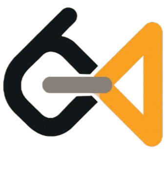

<div align="center">
  
  <h1>LeetVSCode</h1>
</div>

A powerful browser extension for competitive programming and DSA practice that seamlessly integrates with your development workflow. Generate driver code, extract submittable functions, and boost your coding efficiency across all major programming platforms.

[](https://github.com/TanishqAswar/LeetVSCode)
[](https://github.com/TanishqAswar/LeetVSCode)
[](https://github.com/TanishqAswar/LeetVSCode/issues)
[](https://github.com/TanishqAswar/LeetVSCode/blob/main/LICENSE)

## 🚀 Features

### Core Functionality

- **Smart Driver Code Generation**: Automatically generate test harnesses and driver code for competitive programming problems
- **Function Extraction**: Extract clean, submittable functions from your complete VS Code solutions
- **Multi-Language Support**: Full support for C++, Python, JavaScript, Java, and C
- **Custom Templates**: Create and manage personalized boilerplate templates
- **Universal IDE Support**: Works with VS Code, Sublime Text, Notepad++, and any text editor

### Platform Compatibility

- ✅ LeetCode
- ✅ GeeksforGeeks
- ✅ Codeforces
- ✅ HackerRank
- ✅ CodeChef
- ✅ AtCoder
- ✅ TopCoder
- ✅ And many more competitive programming platforms

### Browser Support

- 
- 
- 
- Other Chromium-based browsers

## 📦 Installation

### Method 1: Clone from GitHub (Recommended)

```bash
# Clone the repository
git clone https://github.com/TanishqAswar/LeetVSCode.git
```

### Method 2: Download ZIP

1. Go to [GitHub Repository](https://github.com/TanishqAswar/LeetVSCode)
2. Click **"Code"** → **"Download ZIP"**
3. Extract the ZIP file to your desired location

### Setting Up the Extension
```bash
# Navigate to the project directory
cd LeetVSCode

# Install dependencies
npm install

# Build the project once to have a dist repo in the root
npm run build
```

### Loading the Extension

1. Open your browser (Chrome/Edge/Brave)
2. Navigate to the extensions page:
   - **Chrome**: `chrome://extensions/`
   - **Edge**: `edge://extensions/`
   - **Brave**: `brave://extensions/`
3. Enable **Developer mode** (toggle switch in the top right)
4. Click **"Load unpacked"** button
5. Select the `LeetVSCode/dist` folder (or extracted folder)
6. Confirm the extension is installed and enabled

### Get Your API Key

1. Visit [Google AI Studio](https://makersuite.google.com/app/apikey)
2. Sign in with your Google account
3. Click **"Create API Key"**
4. Copy your free Gemini API key
5. Keep this key secure - you'll need it for setup

## 🛠️ Quick Start

1. **Install the extension** using one of the methods above
2. **Navigate** to any competitive programming problem
3. **Click** the LeetVSCode extension icon
4. **Enter** your Gemini API key (first time only)
5. **Start using** the Generate Code and Extract Function features

## 📚 Documentation

- **[User Guide](docs/USER_GUIDE.md)** - Comprehensive usage instructions
- **[API Documentation](docs/API.md)** - Technical details and customization
- **[Contributing Guide](docs/CONTRIBUTING.md)** - How to contribute to the project
- **[Changelog](docs/CHANGELOG.md)** - Version history and updates

## 🔧 Development Setup

### Prerequisites

- Node.js (v14 or higher)
- npm or yarn
- Chrome/Edge/Brave browser

### Local Development

```bash
# Clone the repository
git clone https://github.com/TanishqAswar/LeetVSCode.git
cd LeetVSCode

# Install dependencies
npm install

# Run development build
npm run dev

# Build for production
npm run build

```

### Project Structure

```
LeetVSCode/
├── src/
│   ├── background/
│   ├── content/
│   ├── popup/
│   └── options/
├── public/
├── docs/
├── manifest.json
└── package.json
```

## 🤝 Contributing

We welcome contributions! Please see our [Contributing Guide](CONTRIBUTING.md) for details.

### How to Contribute

1. Fork the repository
2. Create a feature branch (`git checkout -b feature/amazing-feature`)
3. Commit your changes (`git commit -m 'Add amazing feature'`)
4. Push to the branch (`git push origin feature/amazing-feature`)
5. Open a Pull Request

## 📝 License

This project is licensed under the MIT License - see the [LICENSE](LICENSE) file for details.

## 🙏 Acknowledgments

- Google's Gemini API for powerful code generation
- The competitive programming community for inspiration
- All contributors and users who make this project possible

## 📞 Support

- **GitHub Issues**: [Report bugs or request features](https://github.com/TanishqAswar/LeetVSCode/issues)
- **Discussions**: [Community discussions](https://github.com/TanishqAswar/LeetVSCode/discussions)

## 🌟 Show Your Support

If you find this project helpful, please give it a ⭐ on [GitHub](<(https://github.com/TanishqAswar/LeetVSCode)>)!

As an individual developer and maintainer, your support keeps this project
going.
[💝 Help Project Financially](https://buymeacoffee.com/tanishq_aswar)

---

**Version**: 1.0.0  
**Last Updated**: July 2025  
**Minimum Browser Version**: Chrome 88+, Edge 88+, Brave 1.20+

---

Hare Krishna And Happy Coding! 🚀_
